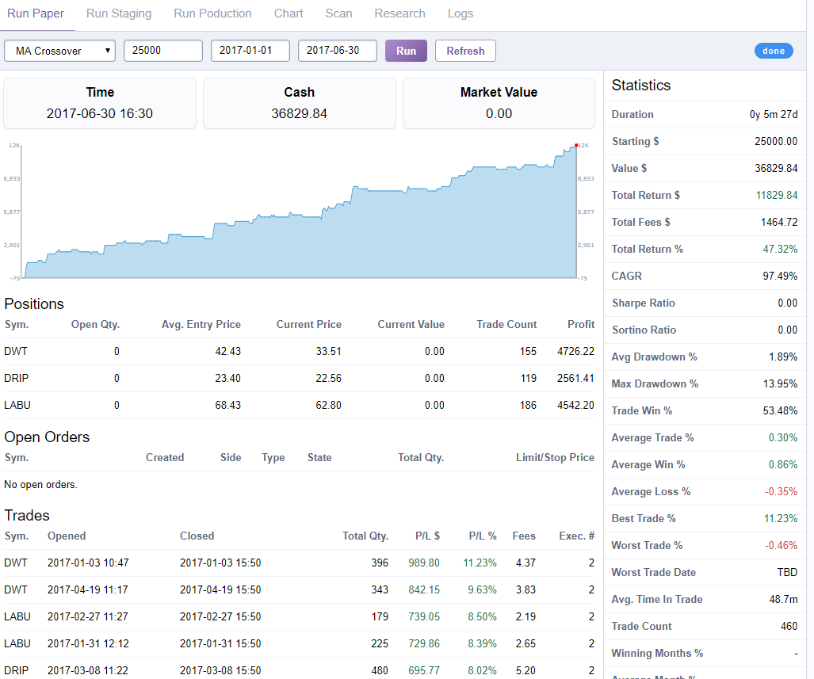

# Toreda

_Trader using the Questrade API and different models to do intra-day second to hours long
trading, written in Go_



## Using

Running `./toreda server` starts a server on port 10888.

Most operations can be done using the web ui, debugging can be done by looking
at log / data files in the `data/` folder.

## Configuration

A `data/qt_credentials.json` file needs to exists with `access_token`,
`refresh_token` and `api_server` keys.

The following environment variables:

```
TOREDA_BASIC_AUTH=user:pass
KIBOT_USERNAME=user@gmail.com
KIBOT_PASSWORD=pass
```

## Exchanging refresh token for access_token

```
http POST https://login.questrade.com/oauth2/token 'grant_type=refresh_token' 'refresh_token=...' -v --form
```

Copy the response to `creds.json`

```
cat data/details/2017-07-20.json | jq '.[] | select(.symbol == "AMZN")'
```

## TODO

- Reports tab -> Table of day stats / Month by month stats
- Research tab -> Enter stock ticker, get fundamental + longer term charts
- Historical tab -> Production run stats for date range
- Mobile view/page
